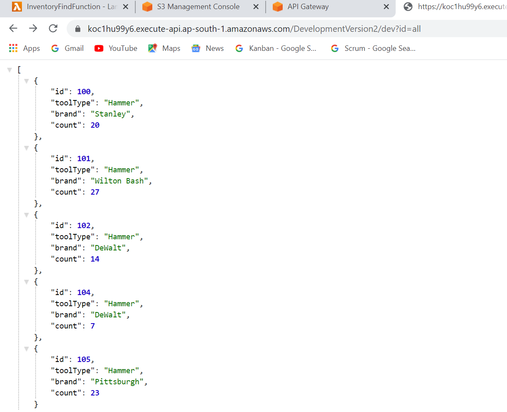

## REST API using AWS Lambda Function 

### Resource (text/json) in S3 bucket

### IAM : 

* Owner account
* User created
* Roles defined

### Lambda Functions and Web API

> Dummy (Inventory)

* Inventory Find
> https://koc1hu99y6.execute-api.ap-south-1.amazonaws.com/DevelopmentVersion2/dev?id=all

* Inventory Insert
* Inventory Delete

### Tested

* Eclipse console
* AWS Console
* Postman
* Browser

### snapshot

